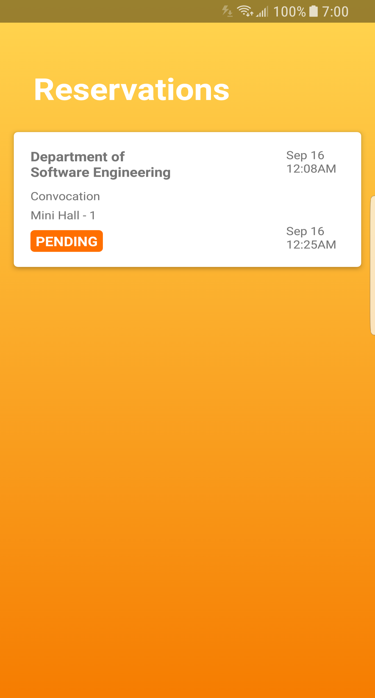

# Android client for the SRM Venue Management server

### Features
* User account system
* View the available venues
* Make, edit, cancel your reservations
* [ADMIN] Add, edit, remove venues
* [ADMIN] Confirm, Reject reservations

### Screenshots

  

### Highlights
* Uses Google's MVP architecture
* Client side caching
* Data binding

### Libraries used
* Retrofit 2.0
* GSON
* Android support libraries
